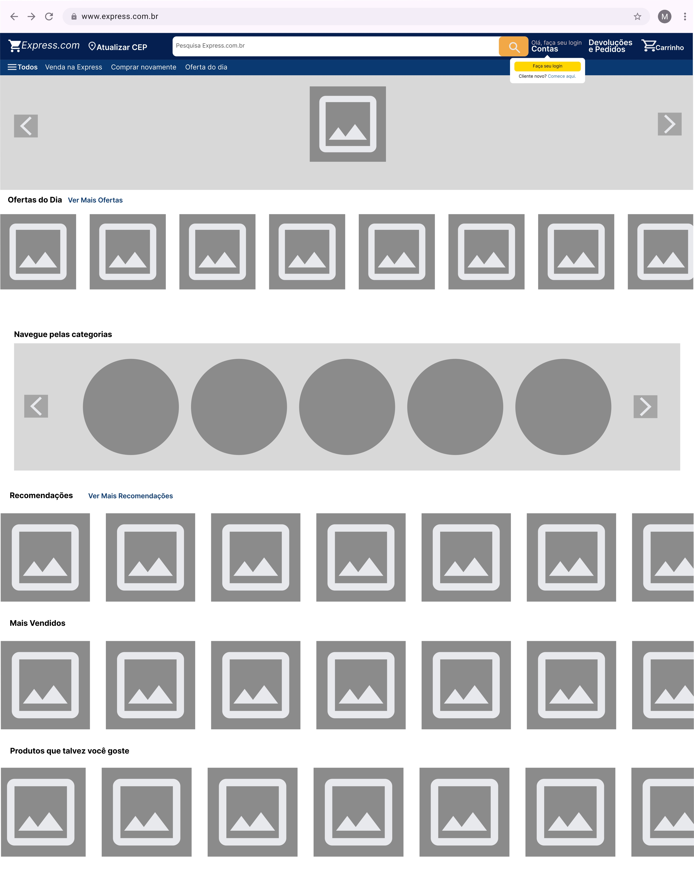
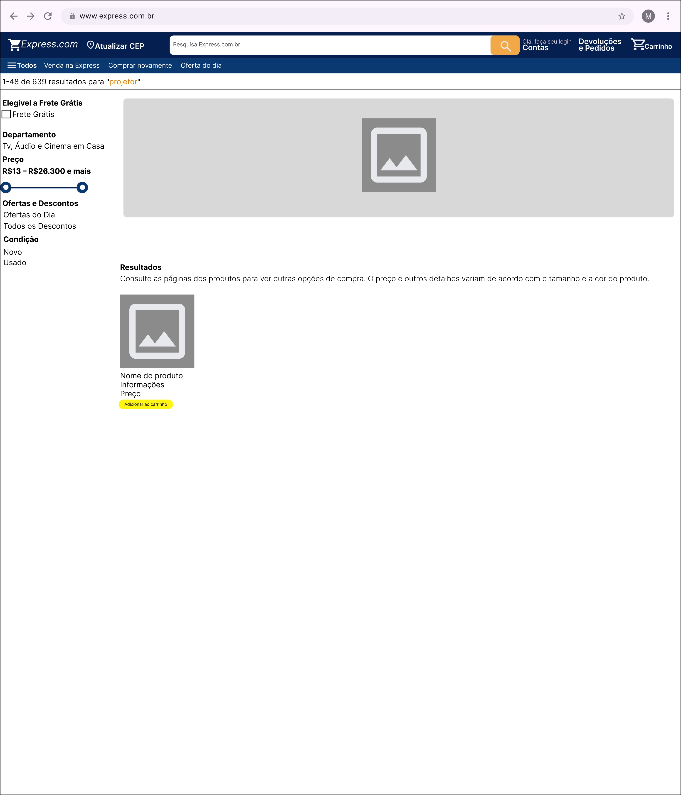

# Universidade
Universidade Federal do Tocantins
## Curso
Ciência da Computação
## Disciplina
Engenharia de Software
## Semestre
2º semestre de 2024
## Professor
Edeílson Milhomem
<h2>Integrantes do Projeto</h2>
<table>
  <tr>
    <td>Luís Gustavo Alves Bezerra</td>
  </tr>
  <tr>
    <td>Mara Emanuella Carvalho Martins</td>
  </tr>
  <tr>
    <td>Neci Oneides da Silva</td>
  </tr>
  <tr>
    <td>Heloisa Rolins Ribeiro</td>
  </tr>
  <tr>
    <td>Dallyla de Moraes Sousa</td>
  </tr>
</table>

# SPRINTS
## Sprint 1: Configuração Inicial e Infraestrutura
Objetivo: Configurar o ambiente de desenvolvimento, banco de dados, autenticação e autorização.
Tarefas:
  - Configuração do servidor e banco de dados.
  - Implementação do sistema de autenticação (login e cadastro de usuário).
  - Integração do backend com o frontend.
  - Testes básicos de login e cadastro.

## Sprint 2:Página Principal e Página Individual do Produto
Objetivo: Desenvolver as funcionalidades básicas de navegação e exibição de produtos.
Tarefas:
  - Implementação da Página Principal com listagem de produtos.
  - Desenvolvimento da Página Individual do Produto com detalhes, imagens e preço.
  - Implementação de filtros e sistema de busca na Página Principal.
  - Testes de exibição e navegação entre páginas.

## Sprint 3: Página Individual do Usuário e Carrinho
Objetivo: Permitir ao usuário gerenciar seu perfil e adicionar produtos ao carrinho.
Tarefas:
  - Desenvolvimento da Página Individual do Usuário com opções de atualizar dados pessoais e visualizar pedidos realizados.
  - Implementação do Carrinho de Compras com adição, remoção e atualização de itens.
  - Integração do carrinho com a página de produtos.

## Sprint 4: Página do Vendedor e Página de Adicionar Produtos
Objetivo: Implementar funcionalidades de vendedor e gerenciamento de produtos.
Tarefas:
  - Desenvolvimento da Página do Vendedor com exibição de produtos vendidos e dados do vendedor.
  - Implementação da Página de Adicionar Produtos para que o vendedor possa criar novos produtos.
  - Integração com o backend para armazenar os produtos criados.
  - Testes de funcionalidades para vendedores.

## Sprint 5: Finalização da Compra e Integração
Objetivo: Concluir o fluxo de compra, incluindo pagamento e confirmação.
Tarefas:
  - Desenvolvimento da Página de Finalização da Compra com opções de pagamento e resumo do pedido.
  - Testes completos do fluxo de compra desde a seleção do produto até a finalização do pagamento.

## Sprint 6: Refinamento e Testes Finais
Objetivo: Revisar, corrigir bugs e refinar o design e usabilidade.
Tarefas:
  - Correção de bugs identificados durante as sprints anteriores.
  - Refinamento da interface e experiência do usuário com base no feedback.
  - Testes de integração de todo o sistema.
    
# Página Principal do Usuário
### Protótipo

## Requisitos
1. **Barra de Busca**: Deverá ser exibida uma barra de busca no cabeçalho da página, permitindo buscas por produtos específicos.
2. **Botão de Atualizar CEP**: Deverá ser incluído um botão para atualizar o CEP na barra de navegação da página, permitindo o cálculo do frete e a estimativa dos prazos de entrega.
3. **Botão de Login/Sign Up**: Um botão de login/sign up deverá estar disponível na barra de navegação da página, indicando se o usuário está logado ou não. Além disso, o botão permitirá um acesso rápido ao cadastro, caso o usuário não tenha uma conta.
4. **Seção de Devolução e Pedidos**: Fornecer uma seção de Devolução e Pedidos, onde o usuário poderá visualizar o histórico de pedidos já feitos e entrar em processo de devolução, caso queira.
5. **Carrinho de Compras**: Exibir o carrinho de compras na barra de navegação, deixando de fácil acesso para o usuário a lista de produtos que não foram finalizados.
6. **Carrossel de Produtos**: Apresentar um carrossel de produtos em destaque, patrocinados e em oferta, exibidos de maneira dinâmica, de fácil visualização para o usuário.
7. **Categorias de Produtos**: Organizar as categorias de produtos na barra de navegação, bem visível, facilitando a navegação do usuário entre os produtos da loja.
8. **Histórico de Navegação**: Mostrar próximo do rodapé da página o histórico de navegação do usuário, listando os produtos vistos recentemente.
9. **Menu Adicional**:
   - **Todos**: Menu que visualiza todas as categorias, acesso rápido às configurações e login.
   - **Venda na Express**: Acesso rápido que encaminha o usuário para o formulário de cadastro para se tornar um vendedor da loja online, ou se já logado como vendedor, o encaminha para a página principal do vendedor.
   - **Comprar Novamente**: Uma opção que permite ao usuário visualizar e comprar produtos que ele comprou anteriormente.
   - **Oferta do Dia**: Um destaque para produtos em oferta especial por tempo limitado.

## User Story: Página Principal do Usuário

Como usuário de uma loja online, quero acessar uma página principal que facilite a minha experiência de compra, para que eu possa encontrar produtos facilmente, gerenciar meu carrinho, e acessar informações importantes sem dificuldade.

## Critérios de Aceitação

1. **Busca de Produtos**: A busca deve retornar resultados relevantes e atualizações em tempo real.
2. **Botão de Atualizar CEP**: O botão de atualizar CEP deve permitir a inserção do mesmo e, após a atualização, recalcular o frete e a estimativa de entrega para os produtos do carrinho.
3. **Botão de Login/Sign Up**: O botão de login/sign up deve sinalizar se o usuário está logado ou não. Se o usuário não estiver logado, o botão deve oferecer um acesso rápido ao formulário de cadastro.
4. **Carrinho de Compras**: O ícone de carrinho dará acesso a todos os pedidos ainda pendentes.
5. **Carrossel de Produtos**: Os anúncios no carrossel deverão ser atraentes e de fácil navegação.
6. **Categorias de Produtos**: Ao clicar na categoria desejada, o usuário é direcionado a uma página com produtos específicos da categoria selecionada.
7. **Histórico de Navegação**: A seção de histórico de navegação deve permitir excluir ou visualizar histórico.
8. **Menu Adicional**: O menu da barra de navegação deve incluir as opções "Todos", "Venda na Express", "Comprar Novamente" e "Oferta do Dia".

## Página de Listagem do Usuário
### Protótipo

### Requisitos

1. **Filtro de Frete Grátis**: Deverá ser exibida uma opção de filtro para selecionar produtos elegíveis para frete grátis. A opção deve estar claramente visível e permitir a seleção de produtos que atendem a esse critério.
2. **Controle Deslizante de Preço**: Um controle deslizante (range slider) deverá estar disponível para o usuário ajustar o intervalo de preço dos produtos. O slider deve ser intuitivo e exibir o intervalo de preços selecionado em tempo real, atualizando os resultados da busca conforme o ajuste.
3. **Filtro de Oferta Especial**: O filtro deve incluir uma opção para visualizar rapidamente produtos que estão em oferta especial por tempo limitado, facilitando o acesso às ofertas do dia.
4. **Filtro de Condição dos Produtos**: Deverá haver uma opção no filtro para selecionar a condição dos produtos, permitindo ao usuário escolher entre "Novo" ou "Usado".
5. **Acesso Rápido a Ofertas**: Deverá ter um acesso rápido à “Ofertas do Dia” e “Todos os Descontos”.
6. **Resultado do Produto**: No resultado do produto buscado deverá aparecer a imagem principal do produto, nome, informações, preço e o botão de adicionar o produto ao carrinho.

### User Story: Página de Listagem do Usuário

Como usuário da loja online, quero poder filtrar os produtos buscados para visualização apenas dos elegíveis a frete grátis ou não, intervalo de preço, se o produto é novo ou usado.

### Critérios de Aceitação

1. **Posição e Visibilidade do Filtro**: O filtro deve estar posicionado à esquerda da página de busca e ser visível e acessível sem necessidade de rolar a página.
2. **Rotulagem Clara**: Cada opção do filtro deve ser claramente rotulada e permitir a seleção/desmarcação com facilidade.
3. **Atualização em Tempo Real**: O filtro deve atualizar os resultados da busca em tempo real, refletindo imediatamente as seleções feitas pelo usuário.
4. **Controle Deslizante de Preço**: O controle deslizante de preço deve ser ajustável e exibir o intervalo de preços atual em tempo real.
5. **Visibilidade das Opções de Filtro**: As opções de filtro (frete grátis, departamento, preço, ofertas do dia, descontos e condição) devem ser mantidas visíveis e permitir múltiplas seleções quando aplicável.
6. **Adicionar ao Carrinho**: Ao apertar em “Adicionar ao carrinho”, o produto é salvo no carrinho, aguardando finalização.

## Login

### Protótipo

## Requisitos

1. O sistema deve permitir que o usuário insira seu email e senha para autenticar-se.
2. O sistema deve ter um botão Acessar que, ao ser clicado, deve verificar as credenciais e, se corretas, redirecionar o usuário para a página inicial.
3. O sistema deve fornecer uma opção para Cadastrar-se, caso o usuário ainda não tenha uma conta.
4. O sistema deve exibir mensagens de erro em caso de email ou senha inválidos.
5. O campo de email deve validar o formato correto de endereço eletrônico antes de permitir o envio do formulário.

## User Story: Login no Sistema  

Como um usuário cadastrado, eu quero poder inserir meu email e senha na tela de login, para que eu possa acessar minha conta e utilizar o sistema de compras.

## Critérios de Aceitação:
1. O campo de email deve aceitar apenas endereços válidos.
2. O campo de senha deve permitir o mínimo de 8 caracteres.
3. O botão "Acessar" deve estar desativado até que todos os campos estejam preenchidos corretamente.
4. Em caso de erro de autenticação, o sistema deve exibir uma mensagem de erro clara, sem revelar detalhes de segurança.
5. A opção "Cadastrar-se" deve redirecionar o usuário para o formulário de registro.

## Cadastro de usuários

### Protótipo

## Requisitos

1. O sistema deve permitir que o usuário insira os seguintes dados no formulário de cadastro:
   - Nome
   - Telefone
   - Categoria (com uma opção de seleção)
   - Email
   - Senha
   - Confirmação de senha
2. O sistema deve validar os campos obrigatórios antes de permitir o envio do formulário.
3. O sistema deve verificar se o email já está registrado e informar o usuário em caso positivo.
4. A senha deve ter no mínimo 8 caracteres e deve ser confirmada no campo "Confirme a senha".
5. O botão "Cadastrar" deve registrar o usuário e redirecioná-lo para a página inicial ou uma página de boas-vindas.
6. O sistema deve exibir mensagens de erro específicas para cada campo inválido ou faltante.
7. O campo de ‘Categoria’ deve conter uma lista suspensa com opções que podem representar diferentes perfis de usuários, como "Comprador" ou "Vendedor".

## User Story: Cadastro de Usuário  

Como um novo usuário, eu quero preencher um formulário de cadastro com meus dados pessoais e preferências, para que eu possa criar uma conta e acessar o site para realizar compras.

## Critérios de Aceitação:
1. Todos os campos obrigatórios devem estar corretamente preenchidos antes de habilitar o botão "Cadastrar".
2. A confirmação de senha deve corresponder exatamente ao campo de senha.
3. O campo de ‘Categoria’ deve conter uma lista suspensa com pelo menos duas opções, por exemplo, "Comprador" e "Vendedor".
4. Caso o email já esteja em uso, o sistema deve exibir uma mensagem clara e permitir que o usuário insira outro email.
5. Após o cadastro bem-sucedido, o sistema deve redirecionar o usuário para uma página de boas-vindas ou a página inicial logada.

## Página individual do usuário

### Protótipo

## Requisitos
1. O sistema deve permitir que o usuário visualize e atualize os seguintes dados pessoais:
   - Nome
   - Telefone
   - Email
   - Gênero
   - CPF
   - Data de nascimento
   - Categoria
2. O sistema deve validar todos os campos antes de permitir a atualização das informações.
3. O sistema deve exibir mensagens de erro específicas caso algum campo não esteja preenchido corretamente ou esteja em branco.
4.O botão "Atualizar" deve salvar as alterações feitas pelo usuário e confirmar a atualização com uma mensagem de sucesso.
5. O sistema deve garantir que o email e CPF fornecidos sejam únicos (não esteja em uso por outro usuário).
6. O sistema deve permitir a modificação dos dados sem precisar informar a senha.
7. O sistema deve permitir que o usuário visualize e atualize os seguintes campos de endereço:
   - CEP
   - Endereço
   - Número da residência
   - Bairro
   - Complemento (opcional)
   - Cidade
   - Estado
8. Todos os campos obrigatórios, como ‘CEP’, ‘Endereço’, ‘Número da residência’, ‘Bairro’, ‘Cidade’ e ‘Estado’, devem ser preenchidos corretamente antes de permitir a atualização.
9. O sistema deve permitir que o usuário cadastre novas formas de pagamento (cartões de crédito ou débito) com os seguintes campos:
   - Nome no cartão
   - Número do cartão
   - CVV
   - Categoria (ex.: Crédito, Débito)
   - Data de expedição
10. O sistema deve validar os campos de pagamento, como o formato correto do número do cartão, validade e CVV.
11. O sistema deve permitir que o usuário remova ou edite formas de pagamento já cadastradas.
12. O sistema deve oferecer uma opção para definir um cartão padrão para pagamentos futuros.
13. O sistema deve exibir mensagens de erro específicas para cada campo inválido ou faltante no formulário de endereço.
14. O botão "Atualizar" deve salvar as alterações feitas nos dados de endereço e confirmar a atualização com uma mensagem de sucesso.
15. O sistema deve permitir que o usuário visualize uma lista de pedidos realizados anteriormente, exibindo os seguintes campos:
   - Nome do produto ou serviço
   - Valor do pedido
   - Status do pedido (ex.: Processando, Enviado, Entregue, Cancelado)
   - Data da realização do pedido
16. O sistema deve exibir o status atualizado dos pedidos, mostrando informações em tempo real (sincronização com o banco de dados).

## User Story: Página individual do usuário  
Como um usuário autenticado, eu quero poder visualizar e atualizar meus dados pessoais na minha conta, para manter minhas informações sempre corretas e atualizadas.

## Critérios de Aceitação:
1. Todos os campos obrigatórios devem estar preenchidos corretamente antes de permitir a atualização.
2. O campo de ‘Gênero’ deve ser opcional ou ter uma lista de opções, como "Masculino", "Feminino", "Outro", etc.
3. O campo ‘Complemento’ deve ser opcional e não impedir a atualização caso esteja em branco.
4. O usuário deve poder visualizar, editar ou excluir cartões já cadastrados com facilidade.
5. Após a atualização bem-sucedida, o sistema deve exibir uma mensagem de confirmação e manter os dados atualizados.
6. O botão "Atualizar" deve estar desativado até que haja alterações nos campos preenchidos pelo usuário.
7. O usuário deve poder visualizar uma lista com todos os pedidos que fez, incluindo o nome do produto, valor, status e data.
8. O sistema deve exibir o status atualizado dos pedidos de forma precisa e em tempo real.

## Carrinho de Compras

### Requisitos

1. O sistema deve permitir que o usuário visualize todos os itens adicionados ao carrinho, exibindo imagem, nome, descrição, quantidade e preço de cada produto.
2. O sistema deve possibilitar que o usuário selecione ou desmarque produtos no carrinho.
3. O sistema deve oferecer a opção de remover itens do carrinho de compras através de um ícone de lixeira.
4. O sistema deve permitir que o usuário ajuste a quantidade de cada item diretamente no carrinho, usando botões de "+" e "-".
5. O sistema deve calcular e exibir o valor total dos itens selecionados no carrinho, com base na quantidade ajustada.
6. O sistema deve fornecer um botão "Fechar Pedido" que, ao ser clicado, deve levar o usuário para a etapa de pagamento.
7. O sistema deve incluir uma opção para o usuário retornar à página anterior.
8. O sistema deve atualizar automaticamente o valor total ao modificar a seleção, a quantidade, ou ao remover itens do carrinho.

### User Story: Gerenciamento do Carrinho de Compras

Como um usuário de um site de compras, eu quero poder visualizar, ajustar a quantidade e remover itens no carrinho, para que eu possa revisar e confirmar minha seleção de produtos e quantidades antes de finalizar a compra.

### Critérios de Aceitação
1. O carrinho deve exibir corretamente todos os itens adicionados com suas respectivas informações, incluindo quantidade.
2. O usuário deve poder marcar ou desmarcar produtos, e o valor total deve ser atualizado em tempo real.
3. O usuário deve poder ajustar a quantidade de itens usando botões de "+" e "-".
4. O ícone de lixeira deve permitir ao usuário remover itens, com o total sendo recalculado automaticamente.
5. O botão "Fechar Pedido" deve redirecionar o usuário para a página de pagamento.
6. A opção de voltar deve levar o usuário à página anterior ou à loja.
